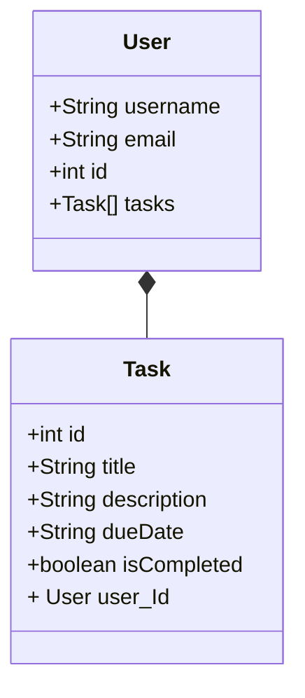

# todo-listAPI

API created for personal organization of tasks and schedule.

## Technologies

- Spring Web
- Spring Data JPA
- OAuth2 Resource Server
- Spring Security
- OpenAPI 3

## Class Diagram

## Documentation Endpoints

# User

- `POST - "/users"` : use to create a new user with basic role.

  {
  "username": "example",
  "password": "example",
  "email": "example@email.com"
  }

- `GET - "/users"` : use to get all users with basic role. Admin's roles only.

# Task

- `POST - "/tasks"` : use to create a new task. You need to login so that accessToken is passed in the response body.

  {
  "title": "example",
  "description": "example"
  }

- - `GET - "/tasks"` : use to get all tasks in the respective user loged.

  -

- `DELETE - "/tasks/{id}"` : use to delete one task in the respective user loged.
