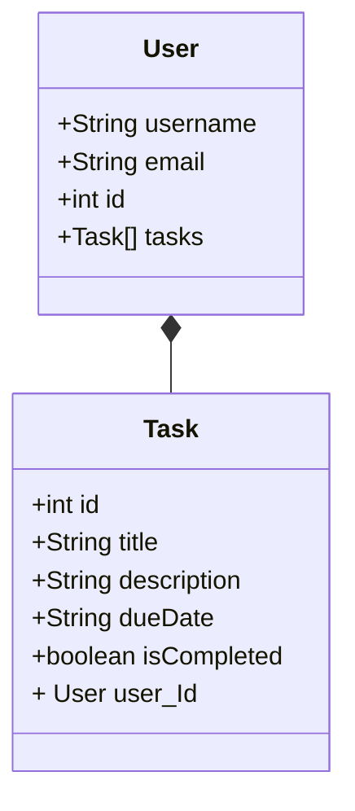

# todo-listAPI

This project is an API for a ToDo List application that allows the creation, reading, updating, and deletion of tasks, as well as user management and authentication.

# Authors
Allan Vargens @programAllan \
[Visit my Linkedin](https://www.linkedin.com/in/allan-vargens-silva-973978196/)


## Technologies

- Spring Web
- Spring Data JPA
- OAuth2 Resource Server
- Spring Security
- OpenAPI 3

## Class Diagram



# Documentation Endpoints

## Controllers

1. UserController
   Controller responsible for user management.

- newUser(@RequestBody CreateUserDTO createUserDTO): Creates a new user.

  HTTP Method: POST \
  Endpoint: /users \
  Authorization: Not required \
  Request Body: 

  ```json
  {
    "username": "username",
    "password": "yourPassword",
    "email": "email@email.com"
  }
  ```

  Response: 200 OK if the user is successfully created.

- listUsers(): Lists all users.

  HTTP Method: GET \
  Endpoint: /users \
  Authorization: Requires authority SCOPE_admin in JWTtoken \
  Response: 200 OK with the list of users. 

- updateUser: Updates an existing user.

HTTP Method: PUT \ 
Endpoint: /users/{id} \
Authorization: Requires the user to be authenticated and be the owner of the provided ID. \
Request Body: a json with username, or email, or password, or a json with the three informations. \
Response: 200 OK if the user is successfully updated, 403 Forbidden if the user attempts to update another user.

2. TokenController
   Controller responsible for authentication and JWT token generation.

- login: Logs in a user and returns a JWT token.
  HTTP Method: POST \
  Endpoint: /login \
  Authorization: Not required \
  Request Body:
  ```json
  {
    "username": "allan.vargens",
    "password": "allanzinho10"
  }
  ```
  \
  Response: 200 OK with the JWT token and expiration time, 401 Unauthorized if the credentials are incorrect.

3. TaskController
   Controller responsible for task management.

- createTask: Creates a new task.

  HTTP Method: POST \
  Endpoint: /tasks \
  Authorization: Requires authorization and the authenticated user to be the owner of the task. \
  Request Body:

  ```json
  {
    "title": "task teste",
    "description": "description"
  }
  ```

  Response: 200 OK if the task is successfully created.

- deleteTask: Deletes an existing task.

  HTTP Method: DELETE \
  Endpoint: /tasks/{id} \
  Authorization: Requires authorization and the authenticated user to be the owner of the task. \
  Response: 200 OK if the task is successfully deleted, 403 Forbidden if the user attempts to delete a task they do not own.

- listTasks: Lists all tasks with pagination.

  HTTP Method: GET \ 
  Endpoint: /tasks \
  Authorization: Not required \
  Request Parameters: page (default: 0), pageSize (default: 10) \
  Response: 200 OK with the paginated list of tasks.

## Entities

1. User
   Represents a user in the system.

2. Task
   Represents a task in the system.

# DTOs

1. CreateUserDTO
   Data transfer object used to create a new user.

2. UpdateUserDTO
   Data transfer object used to update an existing user.

3. LoginRequest
   Data transfer object used for user login.

4. LoginResponse
   Data transfer object used to return the JWT token and expiration time after login.

5. CreateTaskDto
   Data transfer object used to create a new task.

6. ResponseTaskDTO
   Data transfer object used to return the list of tasks.

## Setup and Execution

Clone the repository:

Copiar código

```
git clone https://github.com/your-username/your-repo.git
```

Navigate to the project directory:

```
cd your-repo
```

Set up the dependencies:

```
./mvnw install
```

Run the application:

```
./mvnw spring-boot:run
```


